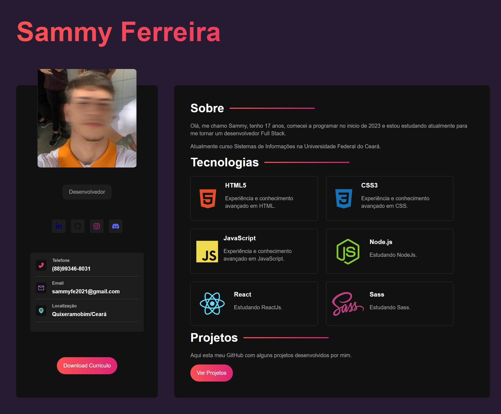

<h1 align="center"> Portifolio Practice </h1>

  <a href="#-sobre">Sobre</a>&nbsp;&nbsp;&nbsp;|&nbsp;&nbsp;&nbsp;
  <a href="#-preview">Preview</a>&nbsp;&nbsp;&nbsp;|&nbsp;&nbsp;&nbsp;
  <a href="#-tecnologias">Tecnologias</a>&nbsp;&nbsp;&nbsp;|&nbsp;&nbsp;&nbsp;
  <a href="#-links">Links</a>&nbsp;&nbsp;&nbsp;|&nbsp;&nbsp;&nbsp;

  

 

## 🧾 Sobre

Projeto feito junto com o Matheus Battist, visando a pratica do React e SASS.

## 🔎 Preview

  

## 🚀 Tecnologias

Esse projeto foi desenvolvido com as seguintes tecnologias:

- ReactJs
- SASS

## 🧾 Links

Acesse o projeto [aqui](https://sammyferreira.vercel.app).

---
